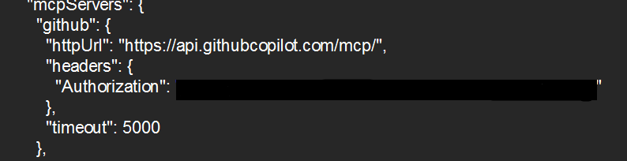
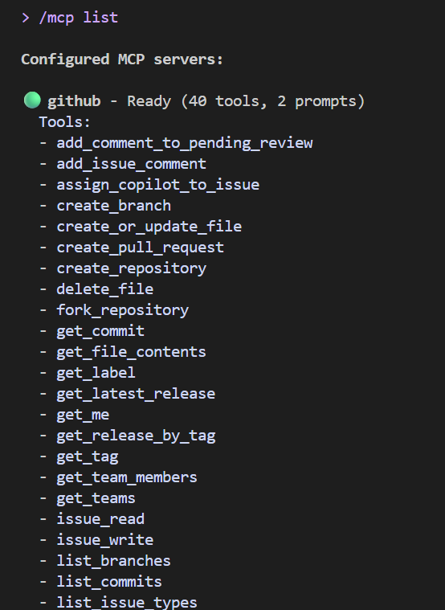

# Solution  
**by Amraha😏**   

---

## **.env**   
📍Since I’ve connected the GitHub MCP server globally, Gemini CLI doesn’t use the global .env file. So I set the token directly in `.gemini/settings.json`, which you must do when connecting any server to the CLI at a global level.    

## **settings.json**  

   

## **/mcp list**

## **List of my Repositories**

   

---

