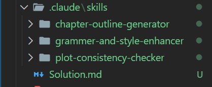

# Skills Overview

## 🟧 **Plot Consistency Checker**

This skill reviews your story for logical flow, continuity, and pacing. It helps you catch plot holes, inconsistent character actions, timeline issues, and missing transitions—making sure the story feels smooth, believable, and connected from start to finish.

## 🟨 **Grammar & Style Enhancer**

This skill polishes your writing while keeping your voice intact. It fixes grammar, improves sentence flow, removes awkward phrasing, and strengthens clarity. The result is cleaner, more engaging text without losing your original tone.

## 🟩 **Chapter Outline Generator**

This skill creates clear and structured chapter outlines based on your story idea. It organizes plot points, character moments, themes, and transitions so you can plan your entire book with confidence and write each chapter with direction.

### ***Screenshot***

---

