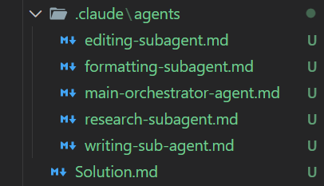

# Book Writing Agent System

This project uses a multi-agent architecture to create well-structured, research-backed, and professionally edited book content. Each agent has a clear role, and the Orchestrator manages the entire workflow.

## 🟪 **Main Orchestrator**
Coordinates all writing tasks. It plans the workflow, assigns sub-agents, checks quality, and assembles everything into a final book.

## 🟫 **Research Sub-Agent**
Collects accurate information, background details, and factual content. It ensures the book stays realistic and well-supported.

## 🟧 **Writing Sub-Agent**
Turns ideas, outlines, and research into full chapters and sections. It handles storytelling, explanations, and draft creation.

## 🟩 **Editing Sub-Agent**
Improves grammar, clarity, style, and flow. It keeps the writer’s tone while refining the text.

## 🟨 **Formatting Sub-Agent**
Prepares the final manuscript format, applies clean structure, and ensures the output is consistent and easy to publish.

Together, these agents form a complete, reliable system for generating high-quality books.

## ***Screenshot***

